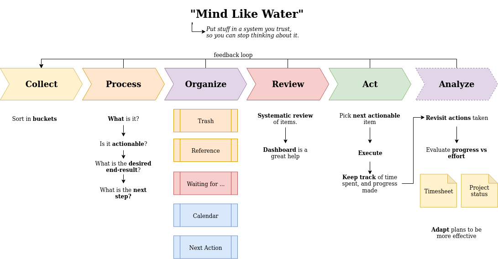
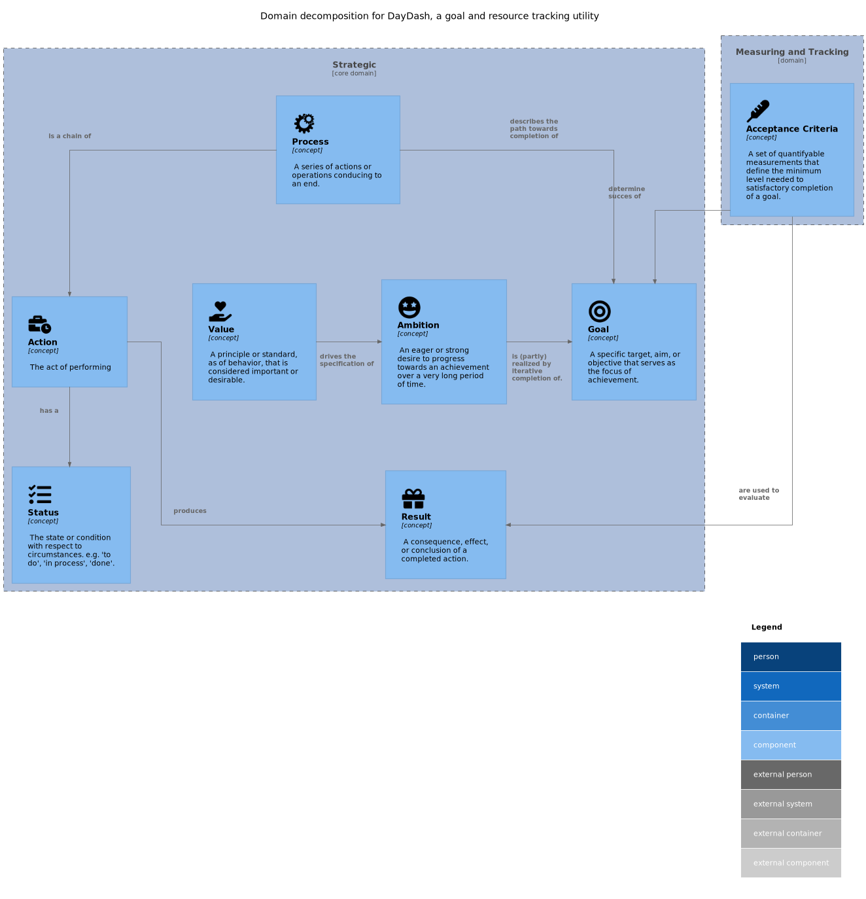

[<- Back to top](/)

## Domain model

Heavily inspired by [Getting Things Done](https://gettingthingsdone.com/) methodology, the end goal is to provide the user with a
customizable flow that allows them a frictionless transition between storing ideas, planning and task-tracking.

### Domain functional decomposition

## Project Structure

### Significant quality attributes

| Principle                                                               | related quality attributes      |
|-------------------------------------------------------------------------|---------------------------------|
| A "pure" core domain containing the logic                               | Maintainability, Extensibility  |
| Modular Adaptors connecting the logic to the outside world              | Extensibility, Interoperability |
| Flexibility of deployment and infrastructure                            | Portability                     |
| Outside interaction trough [RESTful](https://restfulapi.net/) endpoints | Portability, Interoperability   |

### Application layers

Multi-tiered layered approach, mostly following the [hexagonal model](https://en.wikipedia.org/wiki/Hexagonal_architecture_(software)).

## Selected Technology stack

| Technology      | Role                     | Goal                                                                                                           |
|-----------------|--------------------------|----------------------------------------------------------------------------------------------------------------|
| **Java 11**     | Core language            | Primary language of maintainer, as well as an industry standard                                                |
| **Spring Boot** | Infrastructure framework | Industry standard of practise.                                                                                 |
| **Maven**       | Dependency Management    | Industry standard for building java systems. While more formal than groovy, most configuration is easily done. |
| **Jekyll**      | Documentation generator  | Generation of static documentation site                                                                        |
| **LiquiBase**   | Database versioning      | Allow for simple-to-configure definition of database definitions. (Infrastructure-as-code)                     |
| **SonarCloud**  | Static Analysis          | Automated code review, vulnerability analysis                                                                  |
| **Markdown**    | Documentation language   | Low barrier, low ceremony markup language.                                                                     |
| **PlantUml**    | Diagramming tool         | Diagram-as-code solution, allows for in-editor creation of images.                                             |

